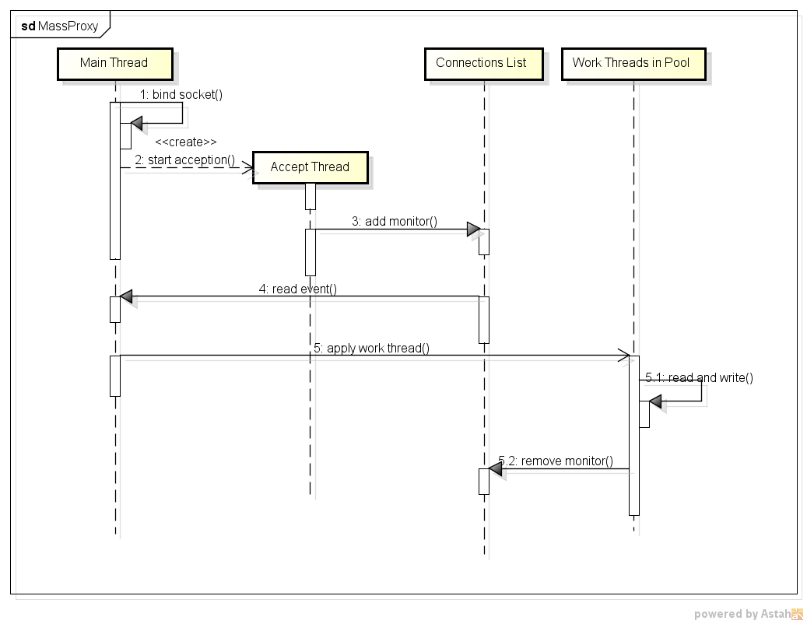

MassProxy
=========

A Simple Proxy Server to maintain massive connections esitablished between clients and servers

Introduction
------------
The main issue of MassProxy to resolve is for massive clients connecting to a bunch of servers via a single (or few) entries. MassProxy is trying to maintain lots of network connections and transparently transfer data between clients and servers. To approach this, MassProxy is using scalable event notification mechanism (say, epoll in Linux 2.6+ for now and intended to be ported to other platforms in the future, like kqueue in FreeBSD).

Design
------
There are 3 main parts used in MassProxy: I/O event monitor, Work thread pool, Connections list. When a connection is accepted, the handler will be added to a list for being monitored. If reading event is seen by I/O monitor, one thread in pool will be waked up and start to read from socket and write data to the peer end. If error or close event is detected, do some cleaning job like remove handler from the monitor list.

